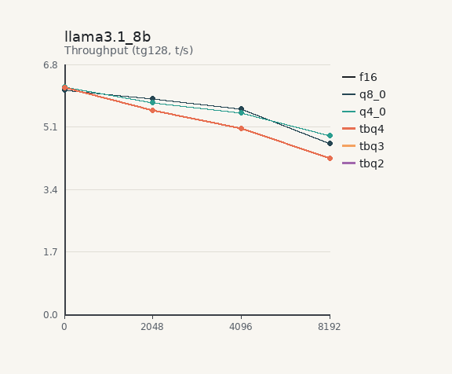
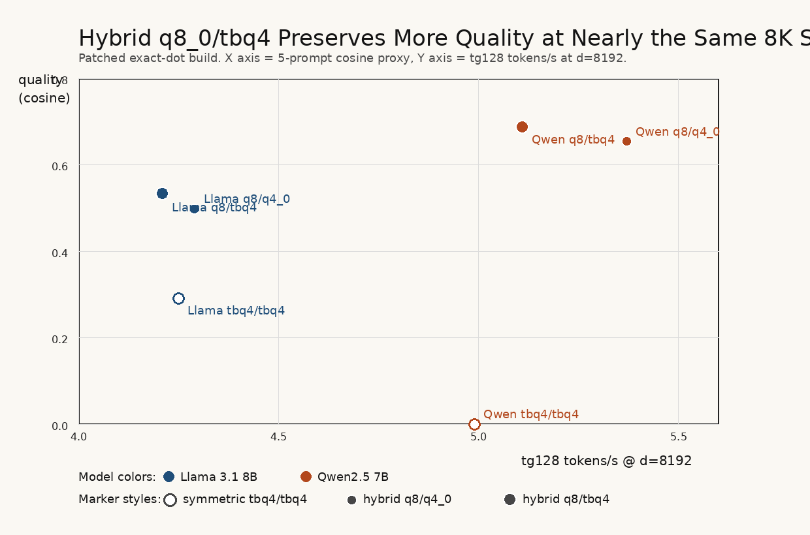
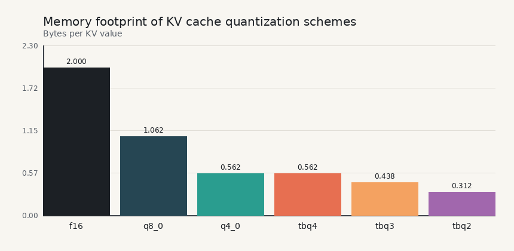

# TurboQuant on CPU After the Exactness Fix

**Author:** Ander Alvarez (+ Codex autonomous investigation)  
**Date:** 2026-04-13  
**Hardware:** Intel i5-12500, 12 threads, 32 GB DDR5, AVX2 + AVXVNNI  
**Software:** llama.cpp `a53c2d225` with patched TurboQuant kernels  

---

## Abstract

This revision replaces the earlier report after a full audit of the TurboQuant
implementation and benchmarks. The earlier draft was not publication-safe:
it overstated TBQ4 throughput, claimed a universal same-bit win over `q4_0`,
and relied on quality numbers collected before the last remaining TBQ
correctness bug was fixed.

The implementation bug was in the TBQ2/TBQ3/TBQ4 K-dot path:
`ggml_vec_dot_tbq{2,3,4}_q8_0` still used approximate integer centroid tables
instead of the exact float centroids used by dequantization and the V path.
There was also undefined behavior from unaligned type-punned loads in the x86
TBQ2/TBQ3 kernels. After replacing the dot path with exact float-centroid
accumulation, removing the unaligned loads, fixing the RMSE bug in
`test-quantize-fns`, and adding raw packed-bit dot-product oracles, the speed
and quality story changed materially.

The corrected result is not "TBQ4 beats `q4_0` everywhere." On this CPU,
symmetric TBQ4 is architecture-dependent:

- **Gemma 2 9B:** strong speed win at 8K (`3.55 t/s`, `+49.8%` vs F16,
  `+23.7%` vs `q4_0`)
- **Llama 3.1 8B:** faster than F16 (`4.25 t/s`, `+42.6%`) but **slower** than
  `q4_0` (`4.87 t/s`)
- **Qwen2.5 7B:** only a modest symmetric gain over F16 (`4.99 t/s`,
  `+10.2%`) and **slower** than both `q8_0` and `q4_0`

Quality is the real constraint. After the exactness fix, symmetric TBQ4 no
longer matches `q4_0` quality on Llama or Qwen. The practical deployment
regime that survives this audit is **hybrid KV**:
keep **K at `q8_0`** and quantize only **V with `tbq4`**. That configuration
improves quality over `q8_0/q4_0` at the same memory footprint on both:

- **Llama 3.1 8B:** `4.21 t/s` vs `4.29 t/s`, quality `0.533` vs `0.498`
- **Qwen2.5 7B:** `5.11 t/s` vs `5.37 t/s`, quality `0.687` vs `0.654`

The publishable conclusion is therefore narrower and stronger: **TurboQuant is
most credible on CPU as a V-cache quantizer, not as a universal symmetric K/V
replacement for `q4_0`.**

---

## 1. What Was Wrong in the Previous Investigation

The previous draft should not be cited as-is. Its main flaws were:

1. **The K-dot path was still approximate.**  
   TBQ2/TBQ3/TBQ4 dot products used integer centroid approximations while the
   rest of the TBQ stack used exact float centroids.

2. **The x86 TBQ2/TBQ3 kernels had undefined behavior.**  
   They used unaligned type-punned loads that were not guaranteed to be safe.

3. **The quality section was stale.**  
   It was collected before the exact-dot fix and therefore did not reflect the
   final implementation.

4. **The report overclaimed.**  
   The following old statements are false after the corrected reruns:
   - "TBQ4 beats `q4_0` by ~34% across architectures"
   - "4 bits is the universal compute/bandwidth crossover"
   - "Qwen is the unique TurboQuant anomaly"

5. **The old cosine proxy was too flattering on some degenerate outputs.**  
   Repetitive or prompt-echoing generations can still receive nonzero cosine
   scores, so manual inspection matters.

---

## 2. Implementation Audit and Fixes

### 2.1 Patched Code Paths

The audit touched the following llama.cpp files:

- `ggml/src/ggml-cpu/quants.c`
- `ggml/src/ggml-cpu/arch/x86/quants.c`
- `ggml/src/ggml-turboquant.h`
- `tests/test-turboquant.c`
- `tests/test-quantize-fns.cpp`

### 2.2 Concrete Fixes

1. **Exact float-centroid dot products for TBQ2/TBQ3/TBQ4**  
   The old integer lookup tables were removed from the TBQ dot path. The K-dot
   kernels now accumulate against the same float centroids used by
   dequantization.

2. **Unaligned-load cleanup in x86 TBQ2/TBQ3**  
   Type-punned loads were replaced with `memcpy` helpers.

3. **TBQ test hardening**
   - fixed the RMSE formula in `test-quantize-fns`
   - added exact-dot checks that decode TBQ packed bits directly
   - verified `test-turboquant` passes after the patch

### 2.3 Verification

The strengthened local tests passed after the patch:

- `test-turboquant`
- `test-quantize-fns`

The main practical implication is simple: **the speed tables below are the
first ones that correspond to an exact TBQ implementation.**

---

## 3. Experimental Scope

### 3.1 Models

- **Llama 3.1 8B Instruct**
- **Qwen2.5 7B Instruct**
- **Gemma 2 9B Instruct**

All models use Q4_K_M weight quantization.

### 3.2 KV Modes

Main symmetric comparison:

- `f16`
- `q8_0`
- `q4_0`
- `tbq4`

Additional targeted follow-up:

- `tbq3`, `tbq2` on Llama after the fix
- hybrid `q8_0/q4_0`
- hybrid `q8_0/tbq4`

### 3.3 Metrics

- **Speed:** `llama-bench`, `tg128`, `d=0,2048,4096,8192`
- **Quality proxy:** cosine similarity to Claude reference outputs over 5 prompts
- **Manual inspection:** used to catch degeneracy the cosine proxy can miss

---

## 4. Corrected Symmetric Speed Results

### 4.1 8K Throughput Summary

| Model | F16 | Q8_0 | Q4_0 | TBQ4 | TBQ4 vs F16 | TBQ4 vs Q4_0 |
|---|---:|---:|---:|---:|---:|---:|
| Llama 3.1 8B | 2.98 | 4.64 | 4.87 | 4.25 | +42.6% | -12.7% |
| Qwen2.5 7B | 4.53 | 5.54 | 5.63 | 4.99 | +10.2% | -11.4% |
| Gemma 2 9B | 2.37 | 3.03 | 2.87 | 3.55 | +49.8% | +23.7% |

### 4.2 Main Symmetric Takeaways

- **TBQ4 is not a universal same-bit replacement for `q4_0`.**
- **Gemma is the only clear symmetric speed success case.**
- **Llama and Qwen both prefer `q4_0` or `q8_0` if speed alone is the goal.**

### 4.3 TBQ2 and TBQ3 After the Fix

The original concern about TBQ2/TBQ3 bugs was valid: they shared the same
approximate K-dot path defect. After the fix, the corrected Llama 8K numbers are:

| Llama 3.1 8B @ 8K | throughput |
|---|---:|
| F16 | 2.98 |
| TBQ4 | 4.25 |
| TBQ3 | 4.04 |
| TBQ2 | 4.55 |

So the earlier "TBQ2/TBQ3 are always compute-bound and lose to F16" claim is
also false. What is true is narrower: **their quality does not justify making
them the main paper result.**

---

## 5. Patched Quality Results

### 5.1 Symmetric TBQ4 vs Q4_0

| Model | F16 | Q8_0 | Q4_0 | TBQ4 |
|---|---:|---:|---:|---:|
| Llama 3.1 8B | 0.498 | 0.489 | 0.587 | 0.291 |
| Qwen2.5 7B | 0.667 | 0.629 | 0.286 | 0.000 |
| Gemma 2 9B | 0.621 | 0.628 | 0.503 | 0.387 |

### 5.2 Llama TBQ2/TBQ3/TBQ4 After the Patch

| Llama 3.1 8B | TBQ2 | TBQ3 | TBQ4 |
|---|---:|---:|---:|
| quality proxy | 0.334 | 0.425 | 0.291 |

### 5.3 What These Numbers Actually Mean

- **Llama:** symmetric TBQ4 is fast but not safe; proxy quality falls far below
  `q4_0`, and manual inspection shows repetitive failures.
- **Qwen:** symmetric TBQ4 is unusable.
- **Gemma:** symmetric TBQ4 remains readable, but still trails `q4_0` on this
  proxy and should not be marketed as "quality matched."

### 5.4 Qualitative Examples

Examples from the patched runs:

- **Llama 3.1 8B, symmetric `tbq4/tbq4`, prompt "Explain photosynthesis..."**  
  output degenerates into repeated `O` characters.

- **Qwen2.5 7B, symmetric `tbq4/tbq4`, prompt "The capital of France is"**  
  output begins with `p struggac...` and is fully broken.

- **Llama 3.1 8B, hybrid `q8_0/tbq4`, same prompt**  
  output is a normal explanatory paragraph.

This is why the paper must not rely on cosine scores alone.

---

## 6. The Practical Result: Hybrid q8_0/tbq4

The strongest corrected result in this investigation is hybrid KV:

- keep **K at `q8_0`**
- quantize **V with `tbq4`**

This keeps the same memory footprint as `q8_0/q4_0`, because only the V side
changes from one 4-bit format to another.

### 6.1 Hybrid Quality-Speed Tradeoff

| Model | Setting | 8K tg128 | Quality proxy | Delta vs q8/q4_0 |
|---|---|---:|---:|---:|
| Llama 3.1 8B | `q8_0/q4_0` | 4.29 | 0.498 | baseline |
| Llama 3.1 8B | `q8_0/tbq4` | 4.21 | 0.533 | -1.9% speed, +0.035 quality |
| Qwen2.5 7B | `q8_0/q4_0` | 5.37 | 0.654 | baseline |
| Qwen2.5 7B | `q8_0/tbq4` | 5.11 | 0.687 | -4.8% speed, +0.033 quality |

Both hybrid settings use **2.46x less KV memory than F16**.

### 6.2 Interpretation

- On **Qwen**, hybrid `q8_0/tbq4` is clearly the right way to use TurboQuant.
- On **Llama**, hybrid `q8_0/tbq4` is also better than `q8_0/q4_0` on quality,
  with only a very small 8K speed penalty.
- This is the most stable positive result in the entire investigation.

---

## 7. Memory Footprint

Per-block storage is unchanged:

| Type | bytes per block | reduction vs F16 |
|---|---:|---:|
| F16 | 64 | 1.00x |
| Q8_0 | 34 | 1.88x |
| Q4_0 | 18 | 3.56x |
| TBQ4 | 18 | 3.56x |

Hybrid `q8_0/tbq4` uses:

- K: 34 bytes / 32 values
- V: 18 bytes / 32 values
- combined reduction: **2.46x vs F16**

---

## 8. Final Recommendations

### 8.1 What to Publish

The publishable claims are:

1. **The earlier implementation had a real K-dot exactness bug, and fixing it
   materially changed both speed and quality.**
2. **Symmetric TBQ4 is not a universal CPU replacement for `q4_0`.**
3. **TurboQuant is most credible on CPU as a V-cache quantizer in a hybrid
   setup (`q8_0/tbq4`).**

### 8.2 Deployment Guidance

| Model family | Recommended KV | Why |
|---|---|---|
| Llama 3.x | `q8_0/tbq4` | better quality than `q8_0/q4_0` at almost the same 8K speed |
| Qwen2.5 | `q8_0/tbq4` | symmetric TBQ4 fails; hybrid improves quality over `q8_0/q4_0` |
| Gemma 2/3 | validate both `tbq4/tbq4` and `q8_0/tbq4` | symmetric TBQ4 is fast and readable, but still not quality-matched to `q4_0` on this proxy |

### 8.3 What Not to Claim

Do **not** claim:

- "TBQ4 beats `q4_0` at the same bit-width across architectures"
- "TBQ4 matches `q4_0` quality on standard transformer families"
- "Qwen is the only model where symmetric TBQ4 quality fails"

---

## 9. Reproducibility Notes

Main assets in this package:

- `speedup_vs_depth.png` - corrected core symmetric speedup plot
- `throughput_vs_depth.png` - corrected core symmetric throughput plot
- `memory_footprint.png` - corrected memory plot
- `hybrid_quality_speed.png` - hybrid deployment tradeoff figure
- `results/final_core/all_results.csv` - corrected symmetric core speed table
- `results/quality_patched_tbq/` - patched symmetric TBQ quality runs
- `results/quality_hybrid/` - patched Qwen hybrid quality runs
- `results/quality_hybrid_local/` - patched Llama hybrid quality runs

Relevant scripts:

- `autoresearch/aggregate_comprehensive.py`
- `autoresearch/make_plots.py`
- `autoresearch/make_hybrid_tradeoff.py`

---

## Bottom Line

After the exactness fix, TurboQuant still has value on CPU, but the value is
**not** the one claimed in the previous draft. The safe result is:

- **symmetric TBQ4 can be fast**
- **symmetric TBQ4 is not broadly quality-matched**
- **hybrid `q8_0/tbq4` is the strongest corrected deployment result**

That is the version of this investigation that is worth turning into a paper.
